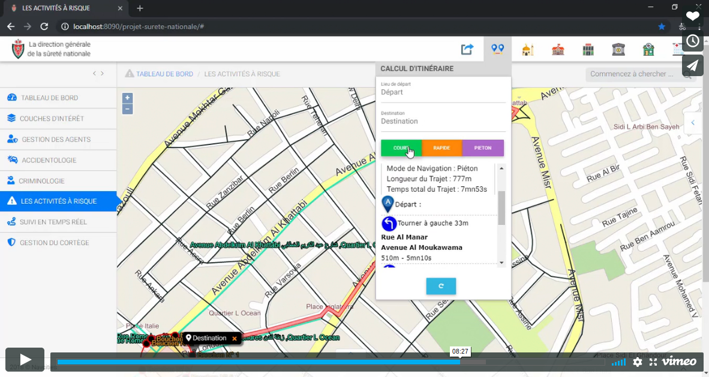

## National Security Project

This project consists in the development of a web application, which presents features helping to improve, develop, speed and good management for the decision making, we find in particular the management of the agents, the crimes, the accidents and some processes (heat map of density, statistics and histories are tools developed for the modules concerned), specification of risky activities such as terrorist acts, real-time monitoring of events and display layers of interest (Pharmacies, hospitals, schools, hotels and banks) being in the position selected by the investigator in the fourth district of Rabat.
Finally, all the information can be exported in the form of map or report thanks to the developed tool of export that in several forms according to the need of the investigator.

Crime mapping
accident mapping

## Demo

[](https://player.vimeo.com/video/350945354?autoplay=true)

## Features

- Layers of Interest Module
- Agents Management Module
- Accidentology Module
- Criminology Module
- Risky Activities Module
- Real-time Tracking of Protests Module
- Management of Procession Module
- Dashboard Module

## Built With

- [OpenLayers v4.6.5](https://openlayers.org/en/v4.6.5/apidoc/).
- [Ol-ext](https://viglino.github.io/ol-ext/).
- [API Navcities](http://www.navcities.com/site/documentation/index.html)
- [Highcharts JS v6.1.1](https://www.highcharts.com/blog/download/).
- [Turf.js](http://turfjs.org/getting-started).
- [DataTables v1.10.19](https://cdn.datatables.net/1.10.19/).
- [SheetJS](http://sheetjs.com/).
- [jQuery v2.1.1](https://code.jquery.com/jquery/).
- [jQuery UI - v1.10.2](https://jqueryui.com/download/all/).
- [MDB](https://mdbootstrap.com/docs/jquery/getting-started/download/).
- Etc.

## Getting Started

### Prerequisites
- PHP 7.
- PostgreSQL **10.5** or above.
- PgAdmin 4.
- Any PHP Server.
- Activate **mb_strtoupper** extension :

  - In Windows :
  
    Edit your php.ini.

  - In a Linux-based system :
  
    ```console
    $ sudo apt install php-mbstring // Installing the extension
    $ sudo service apache2 restart // Restarting the apache server
    ```

### Installation

1. Clone this repository to your local php server directory.
2. Open pgadmin, then create a PostgreSQL database.
3. Right click on your database, choose **Restore** and put this [database backup](https://github.com/samkach/projet-surete-nationale/blob/master/script_base_donnees/base_donnees_spatiale.backup) in **Filename**, then click on **Restore** button.
4. Change the parameters of the **connection_string** in [assets/php/connect.php](https://github.com/sambakk/national-security-project/blob/master/assets/php/connect.php) based on your credentials, see the example below :

    ```
    host=localhost
    port=5432
    dbname=test2
    user=postgres
    password=postgres
    ```
5. Open your browser, then access to the web application, by default : [localhost/national-security-project](http://localhost/national-security-project).

## Notes
- If you get any warnings while restoring the database but the tables were imported successfully, just ignore them and continue.

- To enable errors output in the browser's console, change this variable to **true** in [assets/js/GestionDesModules.js](https://github.com/sambakk/national-security-project/blob/master/assets/js/GestionDesModules.js).

    ```javascript
    var rappErreurs = true;
    ```

## Authors
:octocat: [sambakk](https://github.com/sambakk)

Feel free to ask me questions on Google Hangouts or by Email : bakkach.abdessamad@gmail.com

:octocat: [addouhouda](https://github.com/addouhouda)

## Donation
If this project helped you reduce time to develop, you can give me a cup of coffee :coffee: :heart:

[](http://paypal.me/sambakk)

## License

[](https://github.com/sambakk/facade-3d-lidar-modeling/blob/master/LICENSE)    


